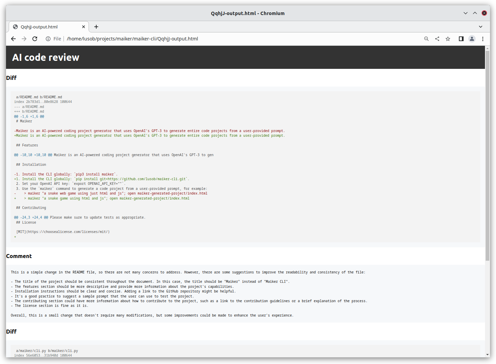

# ChatGPT Code Reviewer

This is a Python program that uses OpenAI's ChatGPT to generate code review comments from diffs. The program reads the diff changes from the standard input, which allows piping from git diffs (or any other diff tool) directly into the program.

```
git diff master..branch | python3 chatgpt_code_reviewer.py
```


https://github.com/lusob/ChatGPTCodeReviewer/assets/480507/5644683a-6c0e-4c0f-bad9-8610fade4de0


## Install

1. Clone this repository and navigate to the ChatGPTCodeReviewer folder
```
git clone https://github.com/lusob/ChatGPTCodeReviewer.git
cd ChatGPTCodeReviewer
```

2. Install Package
```
pip install -r requirements.txt
```

## Usage

1. Export your OpenAI API key and Gilab key as an environments variables:

    ```
    export OPENAI_KEY=<YOUR_OPENAI_API_KEY>
    ```

2. Pipe diffs directly into the program:

    ```
    git diff master..branch | python3 chatgpt_code_reviewer.py
    ```

## Output

The program generates an HTML file that contains the AI generated code review comments for each diff file section, along with the diff sections themselves as code blocks with syntax highlighting. The HTML file is opened in the default web browser for the user to review.

Output example:

